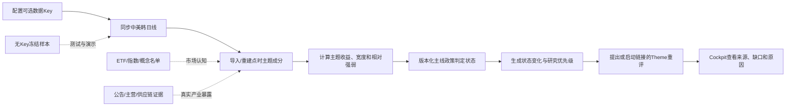

# CapexGraph v0.4 执行计划

- 目标版本：`v0.4.0 — Cross-market data foundation and mainline monitoring`
- 计划状态：实施中；M0/M1首条行情纵切已落地，冻结对照与A股增强源仍待完成
- 基线版本：`v0.3.0`
- 当前总任务：[#8](https://github.com/Mrjie7205/CapexGraph/issues/8)只覆盖调度与重评；
  开发前需按本计划为数据地基、主题宇宙和主线引擎分别建立任务
- 最后更新：2026-07-29

本文件是`ROADMAP.md`中v0.4里程碑的执行级拆解。它把“每日自动运行瓶颈猎手”之前必须
解决的数据前置条件变成可验收的交付顺序。`ROADMAP.md`仍是版本优先级的最终依据。

## 1. 为什么重新定义v0.4

v0.3已经能完成一次有证据约束的Theme/Anchor研究，但当前监控仍依赖Yahoo的单标的、
手工触发快照，也没有能够按历史日期重建的主题股票池。直接在这一基础上加定时器会把
三个问题自动化放大：

1. 中美韩行情口径不统一，复权、交易日、停牌和企业行动缺少质量门禁；
2. 用今天的主题成分回测过去会产生未来函数；
3. ETF或数据商把一只股票列入主题，只能说明市场分类，不能证明真实供应链暴露。

所以v0.4的交付顺序改为：

```text
跨市场日线 → 点时主题宇宙 → 主题宽度/相对强弱 → 主线状态 → 定时运行与重评
```

官方公告、跨市场财报和事件日历进入v0.5；一致预期修正进入v0.6；Catalyst Scan顺延到
v0.7。这个调整不改变CapexGraph“发现机会 → 验证关系 → 形成判断 → 跟踪兑现”的使命。

## 2. v0.4完成后的用户路径



正常使用时，用户可以：

1. 在本地环境变量中配置EODHD；A股增强源按需要再配置Tushare或JQData；
2. 创建一个主题，指定市场、基准指数、代表性指数/ETF以及产业链边界；
3. 查看任意历史日期系统当时已知的主题成员、来源和角色；
4. 盘后运行一次跨市场同步，得到主题价格动量、相对收益、宽度、参与度和数据质量；
5. 查看主题为什么进入、维持、减弱或退出某个主线状态；
6. 对值得继续研究的主题提出一次新的瓶颈扫描或链接到既有研究运行；
7. 在Cockpit中检查高产业暴露但低市场认知的潜在瓶颈标的。

系统不得因为配置了行情Key，就绕过证据审核、自动给出交易指令或把主题分类冒充供应链
事实。

## 3. 核心语义

### 3.1 主题不是一个静态ticker列表

v0.4引入以下一等对象：

- `ThemeDefinition`：稳定主题ID、名称、边界、市场、基准和版本化定义；
- `ThemeSource`：指数、ETF、数据商概念、人工导入或证据图谱等来源；
- `ThemeMembership`：某证券在某段时间内与主题的关系；
- `ThemeUniverseSnapshot`：在一个`as_of`时间点可用的完整股票池；
- `ThemeDailyMetric`：点时股票池对应的确定性市场指标；
- `MainlineAssessment`：某个版本化政策对这些指标做出的状态判断。

`ThemeMembership`至少保存：

```text
theme_id
security_id
role
source_type
source_identity
valid_from
valid_to
known_at
recognition_score
exposure_score
weight
confidence
evidence_ids
retrieved_at
content_hash
```

- `valid_from/valid_to`表示关系或名单何时生效；
- `known_at`表示系统何时能够知道这件事；
- 历史计算同时受两者约束，禁止用后来才知道的关系回填旧信号。

### 3.2 市场认知与产业暴露必须分开

ETF、指数和数据商概念列表用于衡量：

```text
recognition_score = 市场已经多大程度把公司归入该主题
```

公司公告、主营构成、产品认证、客户/供应商关系及经审核的供应链边用于衡量：

```text
exposure_score = 公司真实经营对该主题的暴露程度
```

瓶颈猎手的重要搜索区间是：

```text
高exposure_score + 低recognition_score
```

因此：

- ETF持仓不是主题真相；
- ETF基准指数成分、ETF实际持仓和申赎篮子PCF是三个不同对象；
- 产品重叠或同属一个ETF不能升级为客户、供应商或受益关系；
- 主题市场指标可以使用认知股票池，供应链结论仍必须引用证据。

### 3.3 主线定义保持版本化

v0.4先实现可复现的指标，不在代码中偷渡一个不可讨论的“主线真理”。首版候选输入包括：

- 5/20/60日主题收益和相对基准收益；
- 成分股站上20/50日均线的比例；
- 20/60日新高比例和上涨参与度；
- 收益中位数、分散度和头部集中度；
- 波动率、最大回撤和流动性覆盖；
- 中美韩相关产业主题的确认或背离；
- 信号持续天数、状态切换频率和数据覆盖率。

`MainlinePolicy`必须保存版本、阈值、权重、最小覆盖率和生效时间。进入M3验收前，需要单独
确认主线分类名称和阈值；在确认前只能标记为实验政策，不能写成稳定投资结论。

## 4. 数据Provider范围

### 4.1 日线行情

| Provider | v0.4角色 | 范围 | 边界 |
|---|---|---|---|
| EODHD | P0可选跨市场主源 | US、SHG、SHE、KO、KQ日线 | 不假定覆盖北交所；20美元个人套餐不得支撑公共商业数据服务 |
| Tushare | P1 A股增强与校验 | A股复权、停复牌、涨跌停、每日指标 | 不能替代美韩统一行情源 |
| Yahoo | 无Key fallback | 黄金案例、演示和降级路径 | 非正式、无SLA，不作为生产默认质量基准 |
| 手工/冻结导入 | 测试与可复现路径 | 三市场小型样本 | 只证明软件行为，不冒充当前行情 |

EODHD返回的原始OHLC、`adjusted_close`和拆股调整volume不得被混成一套“全复权OHLC”。
收益默认使用明确标识的调整后收益价格；K线、ATR等指标必须声明使用原始还是调整后口径。

### 4.2 历史主题成分

| 市场 | 首选历史来源 | v0.4接入策略 |
|---|---|---|
| A股 | JQData历史概念；Tushare指数权重、申万行业纳入/剔除 | Provider协议 + 冻结响应 + 至少一个可配置实时适配器 |
| 美股 | 指数/ETF发行商；SEC Form N-PORT公开持仓 | N-PORT/发行商导入器，明确实际持仓不等于基准指数 |
| 韩国 | KRX指数当前/历史数据产品；FnGuide等授权源 | KRX公开导入 + 授权文件导入接口 |
| 通用 | 用户审核的CSV/JSON快照 | 所有市场必须支持，作为授权数据的本地桥梁 |

免费历史往往不完整。系统必须区分：

- `complete`：来源声明且质量检查支持完整；
- `partial`：只有部分日期、季度或ETF；
- `forward_only`：只能从接入日起自行积累；
- `blocked`：授权或覆盖不足，不能进行该段历史回测。

不得把`partial`或`forward_only`悄悄显示成完整历史。

## 5. 实施顺序

### M0 — 数据契约、Provider能力和数据库迁移

优先级：P0

进展（2026-07-29）：

- 已实现`MarketBarSet`、`ProviderCapability`、`DataQualityResult`、`MarketSyncResult`；
- 已增加迁移4、标准化bar和质量报告，并验证旧库增量升级；
- 已实现`.env`加载、显式Provider选择和不返回密钥值的配置状态；
- 主题对象、双时间字段和对应迁移仍归M2交付，不因行情契约完成而提前勾选整个M0。

工作内容：

- 为市场数据定义可声明能力的Provider协议：市场、交易所、历史范围、调整口径、企业行动、
  退市数据、调用限制和许可证类型；
- 定义`MarketBarSet`、`ProviderCoverage`、`DataQualityResult`；
- 定义主题对象和双时间字段；
- 增加SQLite迁移和JSON portability contract；
- 记录正式架构决定，不让行情证据自动变成供应链证据；
- 为密钥增加统一环境变量配置和脱敏诊断。

退出条件：

- 新旧数据库迁移幂等且v0.3运行、checkpoint、tracking和facts计数不变；
- Provider缺少能力时返回结构化`unsupported/partial`，不能返回空数组假装成功；
- 所有新增对象有schema round-trip和时间边界测试；
- 日志、manifest和错误信息不暴露API Key。

### M1 — EODHD跨市场日线与质量门禁

优先级：P0  
依赖：M0

进展（2026-07-29）：

- 已接通US、SHG、SHE、KO、KQ映射、重试、脱敏错误、原始响应本地留存和增量幂等更新；
- 已保留Yahoo显式无Key路径，并把CLI、API、运行快照和tracking接到同一质量门禁；
- 已覆盖日期顺序、重复、OHLC、负volume、adjusted close、未来日期和stale基础检查；
- 已用真实订阅完成US、上海和KRX代表证券的可选live smoke，三者均通过当前基础质量门禁；
- 尚缺交易所日历、停复牌、公司行动、独立参考源差异、三市场冻结样本和A股增强Provider，
  因此M1尚未完成。

工作内容：

- 实现EODHD Provider和ticker映射：
  - 美股`.US`；
  - 上交所`.SHG`；
  - 深交所`.SHE`；
  - 韩国主板`.KO`；
  - KOSDAQ`.KQ`；
- 保存原始响应、规范化bars、Provider版本、抓取时间和哈希；
- 支持增量更新、回补、重试、限流、缓存和明确的stale状态；
- 保留Yahoo为无Key fallback，不静默切换Provider；
- 增加A股增强/校验Provider协议，首个适配器在Tushare与可用授权之间选择；
- 建立三市场冻结质量样本和可选live smoke。

质量检查至少覆盖：

- 日期递增、重复日期、非法OHLC和负volume；
- 交易所/时区/币种；
- 最近可用交易日和停牌/缺失区别；
- 拆股、分红和调整后收益连续性；
- 与独立参考源的共享交易日和收盘价差异；
- 全量回补与增量更新结果一致。

退出条件：

- 有Key时可对三市场代表证券完成两年以上回补和增量更新；
- 无Key时全部冻结测试和黄金案例继续通过；
- 质量报告能够阻止不合格Provider成为某市场默认源；
- 北交所或其他不支持市场明确显示为`unsupported`。

### M2 — 点时主题注册表与历史成分导入

优先级：P0  
依赖：M0

工作内容：

- 主题创建、版本、别名、市场、基准和代表ETF/指数管理；
- 通用CSV/JSON导入器，支持授权数据本地导入而不提交原始文件；
- A股历史概念/行业/指数适配器；
- 美股ETF/指数和SEC N-PORT导入器；
- 韩国KRX当前成分与历史文件导入器；
- 定期保存外部来源快照，并从差异生成纳入/剔除事件；
- 冲突来源并存，不用“最后写入者”覆盖历史；
- 生成`recognition_score`，但不自动填充`exposure_score`；
- 将经审核的供应链关系映射为单独的产业暴露证据。

退出条件：

- 同一主题能够在至少三个历史日期复原不同股票池；
- 未来才纳入或未来才公开的成员不会出现在过去；
- 同一公司可同时保留多个来源、不同角色和不同置信度；
- 删除外部缓存不会删除已持久化的来源身份、哈希和历史快照；
- 测试证明ETF缺席不妨碍高暴露公司进入研究候选。

### M3 — 主题指标与主线状态引擎

优先级：P1  
依赖：M1、M2

工作内容：

- 按点时主题宇宙计算收益、相对强弱、宽度、参与度、分散度、波动和持续性；
- 所有聚合保存样本数、缺失数、覆盖率、权重方法和基准；
- 支持等权、中位数和显式权重，不让缺失数据自动改变口径；
- 定义版本化`MainlinePolicy`和状态变化记录；
- 把政策输入、输出和解释保存为确定性artifact；
- 支持跨市场同主题映射，但不同交易日只能按明确的观察窗口对齐；
- 在最终阈值确认前保留`experimental`标记。

退出条件：

- 过去任意一天的指标只使用当时可用bars和成员；
- 同一输入和政策版本产生完全相同的结果；
- 覆盖不足时不给出确定状态；
- 用户可以看到每次状态变化由哪些指标驱动；
- 主线分类和阈值经过显式产品决定并写入`docs/DECISIONS.md`。

### M4 — 盘后任务、状态事件与链接重评

优先级：P1  
依赖：M1、M2、M3  
对应现有任务：[#8](https://github.com/Mrjie7205/CapexGraph/issues/8)

工作内容：

- 按上海、纽约、首尔交易日历运行盘后任务；
- 一个任务完成行情同步、成分更新、质量检查、主题指标和状态判断；
- 对缺失市场做延迟/部分完成，不用旧数据冒充当日；
- 状态变化生成append-only事件，可确认但不可删除；
- 事件可以：
  - 仅提出Theme Scan；
  - 经显式配置启动链接的新运行；
  - 请求重评既有候选；
- 原始研究运行和原始主线判断保持不可变。

退出条件：

- 重复运行同一市场日期不产生重复bars、快照、指标或事件；
- 失败可从步骤级checkpoint恢复；
- 任务摘要显示成功、部分、阻塞、过期和下一次运行时间；
- 自动路径默认不产生模型费用，除非用户显式开启链接研究执行。

### M5 — Cockpit、端到端验收与v0.4发布

优先级：P0收口  
依赖：M0至M4

Cockpit交付：

- Provider配置状态和覆盖矩阵，不显示密钥；
- 三市场行情新鲜度与质量问题；
- 主题定义、来源、历史成员和纳入/剔除时间线；
- `recognition`与`exposure`并排查看；
- 主题指标、覆盖率、政策版本和状态变化解释；
- 盘后任务、失败、恢复和链接重评；
- 明确标识实验政策、授权缺口和不完整历史。

发布退出条件：

- 新装与v0.3升级数据库都能完成核心路径；
- Python、API、CLI和Web针对同一主题/日期返回一致结果；
- 三市场冻结端到端案例通过；
- 一个可选EODHD live smoke通过但不进入默认CI；
- Ruff、完整Python测试、Web生产构建和wheel检查通过；
- README、CURRENT_STATUS、CHANGELOG、ARCHITECTURE、MONITORING和Provider文档同步；
- 发布文档没有把v0.5公告/事件或v0.6一致预期写成已实现。

## 6. PR拆分

| 顺序 | PR | 主要范围 | 合并门槛 |
|---|---|---|---|
| 1 | 市场/主题契约与迁移 | M0 | legacy/fresh迁移、schema和密钥脱敏 |
| 2 | EODHD Provider与质量框架 | M1 | 三市场冻结样本、增量幂等、质量阻塞 |
| 3 | A股增强Provider | M1 | 复权/停牌语义、EODHD差异报告 |
| 4 | Theme Registry与通用导入 | M2 | 双时间、冲突来源、无未来函数 |
| 5 | CN/US/KR历史成分适配器 | M2 | 每市场冻结响应、partial状态 |
| 6 | 主题指标与MainlinePolicy | M3 | 点时计算、覆盖率、确定性重放 |
| 7 | 调度、事件与链接重评 | M4 | 幂等、失败恢复、成本门禁 |
| 8 | Cockpit与v0.4.0发布 | M5 | 新装/升级/E2E/Web/wheel |

每个PR独立可回滚。不要把数据库迁移、三个市场Provider、主线算法和大规模前端重构塞进
同一个变更。

## 7. 测试矩阵

| 层级 | 必测场景 |
|---|---|
| Provider契约 | 支持能力、unsupported、partial、限流、超时、重试、脱敏 |
| 行情 | 原始/调整字段、日期、币种、时区、拆分分红、停牌、退市、增量幂等 |
| 质量 | 重复、缺失、stale、参考源差异、Provider阻塞与降级解释 |
| 主题时间 | valid/known边界、纳入/剔除、未来函数、冲突来源、定义版本 |
| 来源语义 | 指数、ETF持仓、PCF、数据商概念、产业证据不混用 |
| 指标 | 等权/中位数/显式权重、宽度、相对收益、覆盖不足、跨时区 |
| 主线政策 | 版本、阈值、生效日期、确定性重放、状态切换解释 |
| 任务 | 三市场交易日、重复执行、部分失败、checkpoint、恢复 |
| 重评 | 提出与自动启动分离、原始运行不可变、模型费用显式 |
| 回归 | 旧黄金案例、SEC facts、evidence review、tracking、中文报告 |
| 发布 | Python多版本、Web build、wheel、新装、v0.3数据库升级 |

## 8. Definition of Done

- [ ] 市场和主题契约、迁移及Provider能力声明完成；
- [ ] EODHD中美韩日线接入和质量门禁完成；
- [ ] A股增强/校验源至少有一个可用适配器；
- [ ] 主题定义、双时间成员和历史快照可查询；
- [ ] CN、US、KR至少各有一个冻结历史成分路径；
- [ ] ETF/指数认知与证据化产业暴露在Schema和UI中分离；
- [ ] 主题指标对点时股票池确定性计算；
- [ ] 主线分类与阈值经过单独批准并版本化；
- [ ] 盘后任务幂等、可恢复且默认不触发模型费用；
- [ ] 状态变化和链接重评不修改原始运行；
- [ ] Cockpit可以解释来源、覆盖、质量、指标和状态变化；
- [ ] 无Key黄金路径、完整测试、Web build和wheel通过；
- [ ] 商业Key与授权原始数据没有进入Git或公开fixture；
- [ ] 文档明确v0.5和v0.6能力尚未实现。

## 9. 明确不属于v0.4

- A股/韩国官方公告自动发现和财务taxonomy：v0.5；
- 完整事件日历和产业事件抽取：v0.5；
- 券商一致预期、历史预测修正和业绩surprise：v0.6；
- Catalyst Scan与跨运行证据记忆：v0.7；
- 大规模Cockpit模块化和多用户部署：v0.8；
- 分钟/Tick/Level-2行情；
- 自动下单和投资组合管理；
- 宣称能够免费、完整重建所有历史主题成分。

## 10. 主要风险与控制

| 风险 | 控制 |
|---|---|
| EODHD跨市场方便但A股语义不足 | Tushare/独立参考校验，按市场选择默认Provider |
| 调整价格口径混用 | 原始OHLC、调整后收益价格和企业行动分别存储 |
| 用今天股票池回测过去 | valid/known双时间过滤和未来函数测试 |
| ETF名单替代真实供应链 | recognition/exposure分层，关系仍受Evidence门禁 |
| 免费历史不完整 | complete/partial/forward_only/blocked显式状态 |
| 商业数据进入公库 | 只提交协议、代码和最小合成/公开fixture |
| 定时任务放大错误或成本 | 数据质量阻塞、步骤checkpoint、模型执行默认关闭 |
| 主线阈值被写死后难以讨论 | MainlinePolicy版本化，M3前设置产品决策门 |
| v0.4范围过大 | 严格按M0→M5和PR边界交付，公告/预期/Catalyst不提前 |
